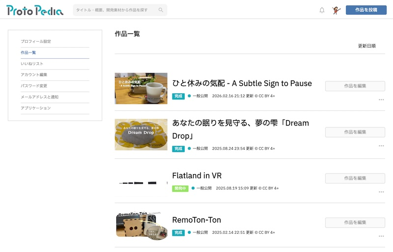
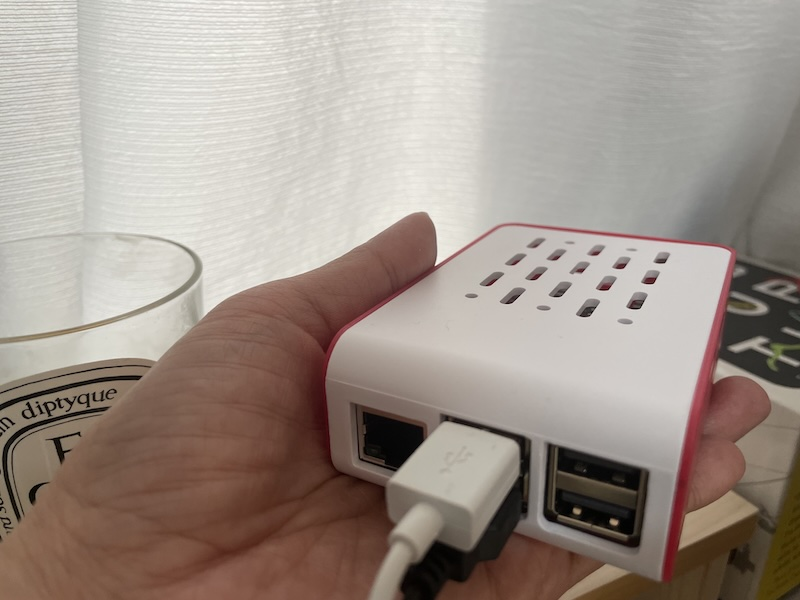

<div class="doc-header">
  <div class="doc-title">地方でものづくりをもっと楽しむために、過去作品をAIに読ませてみた</div>
  <div class="doc-author">水田 千惠（crispytaffy）</div>
</div>

## 目次

- [はじめに](#はじめに)
- [ProtoPediaの紹介](#作品を登録するならprotopediaプロトぺディアがおすすめ)
- [ローカルLLMを試したきっかけ](#始まりはローカルllmを触ってみたいという好奇心)
- [環境構築と試行錯誤](#ラズパイ5で快適に動くための試行錯誤)
- [アイデアが生まれる体験](#自分の作品ひとつひとつが点ではなく線で結びつく楽しさ)
- [まとめ](#まとめ)

## はじめに
この度、生まれ育った宇部市で新しいテックコミュニティが立ち上がるということで、記事執筆に参加してみました。

私自身、大学入学と同時に地元を離れて生活しています。その後2014年頃から、Web技術を囲んでわいわいできる場所を増やしたいという思いから、山口県内のエンジニア仲間と勉強会やハッカソンを主催してきました。宇部での新しいコミュニティの誕生はとても嬉しく、ぜひ一緒に盛り上げていければと思います。

さて、ここからは、**ものづくりにおける生成AI×アーカイブ活用**について紹介します。

イベントで発表したり、コンテストに応募したり、好きな技術を使った作品づくりって楽しいですよね。でも、作り終えたらX投稿だけして、ついそのままになりがちです。

そういうときに限って、自己紹介の場面で「こんな作品を作ってます」と誰かに見てもらいたくなる場面に遭遇することがあります。このような「いざ」というときに備え、作品を記録・公開できるサイトに登録するように心がけています。

そんな私は、個人で電子工作などの創作を楽しむクリエイターです。micro:bitやM5Stackなどの開発コンテストにほぼ毎年作品を応募しているのですが、スタートが遅いのでいつも締め切り目前までバタバタしています。しかも地方在住だと、いいアイデアを思いついても必要な部材がすぐ手に入らず、時間切れになって諦めてしまうこともあります。自分の工作棚（俗にいう「わが家の秋葉原」）のアイテムが頼りです。

そこで、**前もって自分のアイデアの傾向を把握できていれば、作品づくりが捗るのでは**と思い立ち、ローカルLLMの力を借りながら、未来の作品づくりに備える方法を考えてみます。

## 作品を登録するなら、ProtoPedia（プロトぺディア）がおすすめ

私が作品を登録しているのは、一般社団法人MAが運営する「ProtoPedia（プロトぺディア）」[^1]です。ヒーローズ・リーグなどのコンテストやハッカソンでは、応募の際にProtoPediaと連携していることも多く、私が最初に登録したのも、2015年に開催された「ショッカソン2015」に参加したときでした。当時はまだ前身サービスだったと記憶していますが、ProtoPediaになってからも細々と作品登録をしています。

<p align="center">
  
</p>
<p align="center">
  ProtoPediaの作品一覧画面
</p>

ProtoPediaでは作品ごとにページを作り、概要や紹介動画、使った技術、制作意図などが残せます。完成していなくても「開発中」として記録できますし、開発素材や「ねこ」「モビリティ」などのカテゴリで絞り込みながら他のクリエイターの作品を見るのも楽しいです。

## 始まりは「ローカルLLMを触ってみたい」という好奇心

実は今回、アイデアの種を芽生えさせておきたいと思って手を動かしたというより、ローカルLLMを触ってみたいという好奇心がきっかけです。触りたいと思いつつ、環境がないというのが悩みでした。お仕事で使うMacBook Air以外に開発機として使っているゲーミングノートPCもUnity開発に使っていて、ちょうどいいスペックの空きPCがありませんでした。

そんなとき、Raspberry Pi 5（以下、ラズパイ5）でローカルLLMを動かしているという投稿をXで見かけました。ラズパイは以前使ったことがあるのと、ポケットに入れて持ち歩けそうなのも魅力的だったので試してみることに。初期設定のスピード重視で、Traskitさんのスタータキット[^2]を選択しました。その甲斐あって、開封して家にあるモニターやキーボードと接続したら、からあげさんの記事[^3]を参考にしながらOllamaの起動まであっという間にできました。

<p align="center">
  
</p>
<p align="center">
  手のひらサイズのラズパイ5
</p>

モデルに関しては日本語データを学習させてみたかったので、回答速度や日本語のクオリティなどを見ながら、自分がしっくりくるものをいくつか試してみました。結果、Qwen2.5-3Bで進めることにしました。

## ラズパイ5で快適に動くための試行錯誤

環境が整ったところで、何を学習させるか。生成AIと協働するなら、アイデア発散系からやってみようと思い、過去の作品データを取り込んでみることにしました。

自分の作品情報は、ほとんどがProtoPediaに載っています。全部で18件と数は多くないものの、コピペで取るにはちょっと面倒な量です。どうやって取得しようかと調べていたところ、ProtoPedia APIの存在を知りました。自分の作品一覧や詳細をJSONで取得できます。

抽出したデータをscpでRaspberry Pi 5に転送し、1作品ずつPythonで分割しました。その後、全作品を読み込んでQwenに投げたところ、さすがに処理が重くなり、10分以上かかってしまいました。そこで、軽量RAG（Retrieval-Augmented Generation）っぽい形に変更し、条件文（問いかけ）に対して各作品をスコアリングして、関連する上位2〜3作品のみを拾うようにしました。

分析にあたっては、以下をプロンプトに含んでいます。
- 今までの作品の傾向を教えて  
- よく使っている技術は？  
- あまり使ってない領域は？  

生成量を制限したりしながら、何度か試行錯誤するうちに、ラズパイ5でも現実的な速度に改善されました。

## 自分の作品ひとつひとつが、点ではなく線で結びつく楽しさ

ようやく環境が整ったところで、実際にQwenで分析やアイデアの壁打ちをするプロンプトを投げてみます。回答が途中で切れてしまっている場合には生成上限を調整するなどで精度を高めていきます。

例えば以下のようなイメージです。
```bash
python3 idea_rag_stream.py "M5Stack ソレノイド デスク 休憩 気配"
```

あらかじめ自分の作品の特徴（私の場合は、生活動線に溶け込む・行動をやさしく変える・非言語UIを重視など）をルール化しているので、Qwenで実行する際には作品を応募したいコンテストや使いたい技術などを並べるだけでOKです。作品の延長線にあるアイデアが得られたり、使っていない技術や方向性に気づくことができます。何度か試すうちに、「自分らしさ」を保ったまま発想を広げることができてきました。

## まとめ

手軽さ重視で、すぐに手に入る（ポケットにも入る）ラズパイ5を用いたローカルLLM。今回の取り組みは、作品データをProtoPediaに公開していたことで、自由に扱える自分の小さなデータベースがすぐ手元にあったことですんなりと着手できました。「ちょっとローカルLLMを試してみたい」という好奇心の火が消える前に、ひと通りの流れを体験できたのがよかったです。

また、現状では試行錯誤の段階ですが、当初の目的である「未来の作品づくりへの備え」につながるヒントも得られました。この体験をより良いものにしていくため、今後も作品情報を取得しやすい方法で集約・アップデートしておこうというモチベーションが高まりました。次のコンテストが始まるまでに、ローカルLLMを活用しながら、部材集めとスキルアップを楽しもうと思います。


### 注記

[^1]: ProtoPedia（プロトぺディア） https://protopedia.net/

[^2]: Raspberry Pi（ラズパイ）のローカル環境でLLMを動かす（by からあげさん） https://zenn.dev/karaage0703/articles/5fd411a9358898
